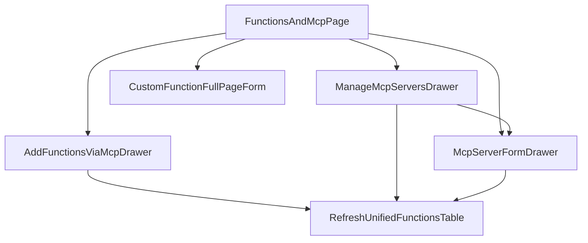

# MCP Functions And Servers Plan

## Current Anchor

The existing host already matches the right page family: `[c:/Users/roy/src/chatbotpage/src/Components/Functions/CFunctionsPage.tsx](c:/Users/roy/src/chatbotpage/src/Components/Functions/CFunctionsPage.tsx)` is an action-driven list/form hybrid page, and `[c:/Users/roy/src/chatbotpage/src/Components/Functions/CFunctionsList.tsx](c:/Users/roy/src/chatbotpage/src/Components/Functions/CFunctionsList.tsx)` is a simple `CDataTable` list with one above-table action.

```20:55:c:/Users/roy/src/chatbotpage/src/Components/Functions/CFunctionsPage.tsx
export const CFunctionsPage = ({ action }: CFunctionsPageProps) => {
  const hasViewPermission = useHasPermission("viewAIAgents");
  const { t, navigationValue, aiAgentId, descriptionContent } = functionsApp({
    action,
  });

  return hasViewPermission ? (
    <NavigationProvider value={navigationValue} key={aiAgentId}>
      <CSmallTalkStyled hidden={action !== ""}>
        <CPage id="functionsList" ifListPage title={t("AIAgent_Functions")}>
          <CPageWrapper>
            <CPageList>
              {aiAgentId && (
                <CFunctionsList aiAgentId={aiAgentId} hidden={action !== ""} />
              )}
            </CPageList>
          </CPageWrapper>
        </CPage>
      </CSmallTalkStyled>
      {action !== "" && <CFunctionFormPage aiAgentId={aiAgentId} />}
    </NavigationProvider>
  ) : (
    <CNoPermission permissionName="View AI Agent" />
  );
};
```

```76:145:c:/Users/roy/src/chatbotpage/src/Components/Functions/CFunctionsList.tsx
<CTableHeaderStyled>
  <div>
    <CComponentAboveTable>
      <CFunctionNewButton disabled={readonly} />
    </CComponentAboveTable>
  </div>
</CTableHeaderStyled>
<CDataTable
  domainService={functionDomainService}
  query={query}
  enablePagination
  defaultSort={{ key: "name", order: "asc" }}
  columns={[
    { id: "name", ... },
    { id: "usedInTopics", ... },
  ]}
  operations={[
    { operationComponent: CTableBodyOperationEdit },
    { operationComponent: ({ row, index }: any) => { /* delete */ } },
  ]}
/>
```

The MCP spec requires this surface to become a unified list with MCP actions: `[c:/Users/roy/src/productspecs/Specification/AIAgent-MCP.md](c:/Users/roy/src/productspecs/Specification/AIAgent-MCP.md)` calls for `Add Functions via MCP`, `Manage MCP Servers`, unified custom + MCP rows, type badges, source filter, and per-row MCP manage action. Design-wise this should follow the existing hybrid list host plus list-management and management-drawer patterns from:

- `[c:/Users/roy/src/chatbotpage/design/action-driven-list-form-hybrid-pages.md](c:/Users/roy/src/chatbotpage/design/action-driven-list-form-hybrid-pages.md)`
- `[c:/Users/roy/src/chatbotpage/design/list-and-management-pages.md](c:/Users/roy/src/chatbotpage/design/list-and-management-pages.md)`
- `[c:/Users/roy/src/chatbotpage/design/detail-preview-and-management-drawers.md](c:/Users/roy/src/chatbotpage/design/detail-preview-and-management-drawers.md)`
- `[c:/Users/roy/src/chatbotpage/design/nested-and-stacked-drawers.md](c:/Users/roy/src/chatbotpage/design/nested-and-stacked-drawers.md)`
- `[c:/Users/roy/src/chatbotpage/design/integration-and-connection-pages.md](c:/Users/roy/src/chatbotpage/design/integration-and-connection-pages.md)`

## Features To Add

### 1. Unified Functions And MCP list

Add MCP-backed functions into the existing functions table instead of creating a separate page.

- Rename page/title conceptually to `Functions & MCP` while keeping the current hybrid host.
- Load custom functions and MCP function projections in one table.
- Show MCP rows by qualified name such as `linear::create_issue`.
- Add `Type` badge column with `API`, `LLM`, `MCP`.
- Add `Source` column showing connected MCP server display name for MCP rows.
- Keep `Used in Topics` column.
- Add above-table search/filter controls for `type` and `source`.
- Keep `New Function` for API/LLM only.
- Add `Add Functions via MCP` action.
- Add `Manage MCP Servers` action.
- Add per-row MCP `Manage` action that opens the corresponding standalone `CMcpServerFormDrawer` for the owning server.

### 2. MCP server connection management

Add connected-server management for the current AI Agent.

- Browse all MCP servers connected to the agent.
- Show server type `Prebuilt` or `Custom`.
- Show credential, status, tool count, and last sync.
- Support status-based server actions: show `Sync` for connected servers, show `Reconnect` for disconnected servers, never show both on the same server row, and keep `Disconnect` available as the destructive action.
- Preserve parent list context while server management is open.

### 3. Add Functions via MCP flow

Add the connection flow launched from the list header.

- First choose connection method: prebuilt provider catalog vs custom MCP server.
- Provider catalog is a chooser inside the flow, not a separate management page.
- Prebuilt flow should support provider-specific connect/auth entry.
- Custom flow should capture display name, endpoint URL, and selected authorization credential.
- Include link-out to the existing credentials management page for creating missing credentials.
- Finish by syncing tools and returning to the unified list.

### 4. MCP server form and tools management

Add reusable server editing and tool management for a selected MCP server.

- Open the standalone `CMcpServerFormDrawer` for the selected server.
- Display editable server fields plus the synced tool list in the same drawer.
- Show tool name and description.
- Toggle tool enable/disable.
- Explain that disabled tools are hidden from agent use/runtime.
- Keep this as a drawer, not a separate route.

### 5. Empty/error/loading states

Add states required by the spec and consistent with list/drawer patterns.

- Empty functions state after filters.
- Empty connected servers state with primary CTA to add via MCP.
- Disconnected server status badge and `Reconnect` action; connected servers show `Sync` instead.
- Sync/validation failures surfaced in the drawer flow.
- Preserve permission gating with existing AI Agent manage permission.

## Pages And Drawers To Change Or Create

### Change: Functions host page

Target file: `[c:/Users/roy/src/chatbotpage/src/Components/Functions/CFunctionsPage.tsx](c:/Users/roy/src/chatbotpage/src/Components/Functions/CFunctionsPage.tsx)`

- Keep current list/form hybrid route model.
- Update header copy and list-level state needed to open MCP drawers.
- Keep `CFunctionFormPage` as the full-page create/edit surface for custom functions.

### Change: Functions table page content

Target file: `[c:/Users/roy/src/chatbotpage/src/Components/Functions/CFunctionsList.tsx](c:/Users/roy/src/chatbotpage/src/Components/Functions/CFunctionsList.tsx)`

- Expand header actions and filters.
- Expand table columns and row actions.
- Coordinate unified query state for search, type, source, and refresh.
- Switch from custom-function-only data model to unified function rows.

### Create: Add Functions via MCP drawer

Suggested new surface under `[c:/Users/roy/src/chatbotpage/src/Components/Functions/](c:/Users/roy/src/chatbotpage/src/Components/Functions/)`

- Entry from header action.
- Use a connection-oriented drawer pattern rather than a full page.
- Use `CTabs` inside one drawer so the prebuilt server flow stays table-first and the custom server flow stays form-first.

### Create: Manage MCP Servers drawer

Suggested new surface under `[c:/Users/roy/src/chatbotpage/src/Components/Functions/](c:/Users/roy/src/chatbotpage/src/Components/Functions/)`

- Entry from the header action.
- Large management drawer listing connected servers for the current AI Agent.
- Server rows in this drawer can optionally reuse `CMcpServerFormDrawer`, but the form drawer is not dependent on this parent surface.

### Create: MCP Server form drawer

Suggested new surface under `[c:/Users/roy/src/chatbotpage/src/Components/Functions/](c:/Users/roy/src/chatbotpage/src/Components/Functions/)`

- Standalone/reusable drawer opened directly from the MCP function-row manage action.
- Can also be reused from a server row inside `CMcpManageServersDrawer` when needed.
- Edit the selected MCP server and manage its tools list in one place.

### Change or create: Functions app state helpers

Primary files likely under:

- `[c:/Users/roy/src/chatbotpage/src/Components/Application/Functions/FunctionsApp.ts](c:/Users/roy/src/chatbotpage/src/Components/Application/Functions/FunctionsApp.ts)`
- `[c:/Users/roy/src/chatbotpage/src/Components/Application/Functions/FunctionListApp.ts](c:/Users/roy/src/chatbotpage/src/Components/Application/Functions/FunctionListApp.ts)`
- `[c:/Users/roy/src/chatbotpage/src/Hooks/useBotDomainServices.ts](c:/Users/roy/src/chatbotpage/src/Hooks/useBotDomainServices.ts)`

These need MCP-aware list query state, drawer open/close state, refresh coordination, and access to MCP server/tool domain services.

### Possibly change: credentials deep link helpers

Reuse existing credentials pages rather than creating new credential UI.

- `[c:/Users/roy/src/chatbotpage/src/Components/Apps/AuthorizationCredentials/Credentials/index.tsx](c:/Users/roy/src/chatbotpage/src/Components/Apps/AuthorizationCredentials/Credentials/index.tsx)`
- `[c:/Users/roy/src/chatbotpage/src/Components/Apps/AuthorizationCredentials/Credential/index.tsx](c:/Users/roy/src/chatbotpage/src/Components/Apps/AuthorizationCredentials/Credential/index.tsx)`

## Page And Drawer Design Details

### Functions & MCP page

Pattern: list-management page inside the existing hybrid host.

Components to use:

- `CPage`, `CPageWrapper`, `CPageList`
- `NavigationProvider`
- `CComponentAboveTable`
- `CTableHeaderStyled`
- `CTableFilter`
- `CTableFilterControl`
- `CFunctionNewButton`
- `CMcpAddFunctionsButton`
- `CMcpManageServersButton`
- `CKeywordSearch`
- `CSelect`
- `CDataTable`
- `CFunctionsNameTableCell`
- `CFunctionsTypeTableCell`
- `CFunctionsSourceTableCell`
- `CFunctionsStatusTableCell`
- `CFunctionsUsedinTopicsTableCell`
- `CTableBodyOperationEdit`
- `CTableBodyOperationDelete`
- `CMcpFunctionManageOperation`

Design details:

- Keep list as the primary surface because browsing and operating on many functions is the main job.
- Continue using the current route-based full-page form for custom function create/edit.
- Do not add raw CSS; compose with existing framework/styled table and page wrappers.
- Show custom rows and MCP rows in one table, with row behavior conditional on type.
- Use the framework table-filter pattern from existing pages such as `CBookedMeetingsContent.tsx` and `CBotLearnComplete.tsx`: `CTableFilter initialValues={filterValues} onFilter={handleFilter}` wrapping `CTableFilterControl` entries.
- In the right-side filter area, place `CTableFilterControl component={CSelect} name="typeFilter"` first, `CTableFilterControl component={CSelect} name="sourceFilter"` second, and `CTableFilterControl component={CKeywordSearch} name="keywords"` as the right-most control.
- `CFunctionsNameTableCell` uses `CTopicTableBodyCellLinkButton` for custom rows and `CFunctionsTableBodyCellText` for MCP rows.
- `CFunctionsTypeTableCell` renders `CChip`.
- `CFunctionsStatusTableCell` renders `CChip` only for MCP rows; custom-function rows render an empty cell because they do not have MCP connection status.
- `CMcpFunctionManageOperation` uses `CIconButton` to open `CMcpServerFormDrawer` directly for the owning server.
- Custom rows keep `CTableBodyOperationEdit` and `CTableBodyOperationDelete`; MCP rows use `CMcpFunctionManageOperation` instead.

Component hierarchy sketch:

```jsx
<CFunctionsPage action={action}>
  <NavigationProvider value={navigationValue}>
    <CSmallTalkStyled hidden={action !== ""}>
      <CPage id="functionsList" ifListPage>
        <CPageWrapper>
          <CPageList>
            <CFunctionsList aiAgentId={aiAgentId} hidden={action !== ""}>
              <CTableHeaderStyled>
                <div>
                  <CComponentAboveTable>
                    <CFunctionNewButton />
                    <CMcpAddFunctionsButton />
                    <CMcpManageServersButton />
                  </CComponentAboveTable>
                </div>
                <div />
                <div>
                  <CTableFilter
                    initialValues={filterValues}
                    onFilter={handleFilter}
                  >
                    <CTableFilterControl
                      name="typeFilter"
                      component={CSelect}
                      options={typeFilterOptions}
                      placeholder="Type"
                      clearable
                    />
                    <CTableFilterControl
                      name="sourceFilter"
                      component={CSelect}
                      options={sourceFilterOptions}
                      placeholder="Source"
                      clearable
                    />
                    <CTableFilterControl
                      name="keywords"
                      component={CKeywordSearch}
                      placeholder={t("AIAgent_Functions_Search")}
                    />
                  </CTableFilter>
                </div>
              </CTableHeaderStyled>

              <CDataTable>
                <CFunctionsNameTableCell />
                <CFunctionsTypeTableCell>
                  <CChip />
                </CFunctionsTypeTableCell>
                <CFunctionsSourceTableCell />
                <CFunctionsStatusTableCell>
                  {isMcpRow && <CChip />}
                </CFunctionsStatusTableCell>
                <CFunctionsUsedinTopicsTableCell />

                <CTableBodyOperationEdit />
                <CTableBodyOperationDelete />
                <CMcpFunctionManageOperation>
                  <CIconButton />
                </CMcpFunctionManageOperation>
              </CDataTable>
            </CFunctionsList>
          </CPageList>
        </CPageWrapper>
      </CPage>
    </CSmallTalkStyled>

    <CMcpAddFunctionsDrawer />
    <CMcpManageServersDrawer />
    <CMcpServerFormDrawer
      open={Boolean(managedServerId)}
      serverId={managedServerId}
    />

    {action !== "" && <CFunctionFormPage aiAgentId={aiAgentId} />}
  </NavigationProvider>
</CFunctionsPage>
```

### Add Functions via MCP drawer

Pattern: integration/connection drawer opened from the page header.

Components to use:

- `CDrawerPage`
- `CTabs`
- `CForm`
- `CFormControlGroupContainer`
- `CFormControlGroup`
- `CFormControlGroupItem`
- `CFormControl`
- `CSelect`
- `CInput`
- `CFormAction`
- `CFormActionSubmitButton`
- `CFormActionCancelButton`
- `CFormSkeleton`
- `CProgress`
- `CTableSkeleton`
- `CDataTable`
- `CMcpProviderCatalogTable`
- `CMcpProviderNameTableCell`
- `CMcpProviderDescriptionTableCell`
- `CMcpProviderConnectOperation`
- `CMcpCustomServerForm`

Design details:

- Use `CDrawerPage` with `size="large"`, a dedicated page id for the MCP connect flow, and `description={t("AIAgent_Mcp_AddDescription")}` for the top explanatory copy.
- Render `CTabs` at the top of the drawer with `prebuilt` and `custom` tabs; the tab selection is view state, not a submitted form field.
- The `prebuilt` tab is table-only: render `CMcpProviderCatalogTable`, which wraps `CDataTable` and uses `CMcpProviderConnectOperation` as the only connect action for each provider row.
- Do not render a page-level submit action in the `prebuilt` tab; connecting a prebuilt provider happens only through the row-level connect operation that starts OAuth, creates the credential, and triggers the initial tool sync.
- The `custom` tab is form-only: render `CMcpCustomServerForm`, which wraps `CForm` and stacks `displayName`, `endpointUrl`, and `authorizationCredentialId` vertically by placing each field in its own `CFormControlGroupItem xs={12}`.
- In the custom tab, `displayName` is required because the spec defines it as a provided custom-server field.
- In the custom tab, `endpointUrl` is required because the spec and entity model define it as required for Custom MCP servers.
- In the custom tab, `authorizationCredentialId` is required because the spec requires Custom MCP servers to use an existing Authorization Credential.
- Put the Authorization Credentials entry into the `authorizationCredentialId` field's `helperText` instead of rendering a standalone action below the field.
- Because form helper text is rendered through `CHtmlText`, the helper text content should include the credentials-management link that opens the Authorization Credentials page in a new tab.
- Use `CTableSkeleton` while loading the provider catalog and `CFormSkeleton` while loading credential data for the custom tab.
- Use `CProgress` only for the prebuilt provider row connect flow when OAuth/connect/sync is in progress.
- In the custom tab, rely on `CFormActionSubmitButton`'s built-in submitting state instead of rendering a separate `CProgress`.
- After a successful connection from either tab, call `dispatchSuccessfullEvent(...)`, refresh the unified functions table, and close the drawer immediately instead of rendering a dedicated success panel.

Component hierarchy sketch:

```jsx
<CMcpAddFunctionsDrawer open={isOpen} aiAgentId={aiAgentId}>
  <CDrawerPage
    pageId="Mcp_AddFunctions"
    size="large"
    onClose={handleClose}
    description={t("AIAgent_Mcp_AddDescription")}
  >
    <CTabs
      tabOptions={mcpAddTabOptions}
      value={activeTab}
      onChange={handleTabChange}
    />

    {activeTab === "prebuilt" && (
      <>
        {isLoadingProviders ? (
          <CTableSkeleton />
        ) : (
          <CMcpProviderCatalogTable>
            <CDataTable>
              <CMcpProviderNameTableCell />
              <CMcpProviderDescriptionTableCell />
              <CMcpProviderConnectOperation />
            </CDataTable>
          </CMcpProviderCatalogTable>
        )}

        {isConnectingProvider && <CProgress />}
      </>
    )}

    {activeTab === "custom" && (
      <>
        {isLoadingCredentials ? (
          <CFormSkeleton />
        ) : (
          <CMcpCustomServerForm initialValues={customServerValues}>
            <CForm>
              <CFormControlGroupContainer>
                <CFormControlGroup>
                  <CFormControlGroupItem xs={12}>
                    <CFormControl component={CInput} name="displayName" required />
                  </CFormControlGroupItem>
                  <CFormControlGroupItem xs={12}>
                    <CFormControl component={CInput} name="endpointUrl" required />
                  </CFormControlGroupItem>
                  <CFormControlGroupItem xs={12}>
                    <CFormControl
                      component={CSelect}
                      name="authorizationCredentialId"
                      helperText={authorizationCredentialHelperText}
                      required
                    />
                  </CFormControlGroupItem>
                </CFormControlGroup>
              </CFormControlGroupContainer>
              <CFormAction>
                <CFormActionSubmitButton />
                <CFormActionCancelButton onCancel={handleClose} />
              </CFormAction>
            </CForm>
          </CMcpCustomServerForm>
        )}
      </>
    )}
  </CDrawerPage>
</CMcpAddFunctionsDrawer>
```

### Manage MCP Servers drawer

Pattern: detail/management drawer.

Components to use:

- `CDrawerPage`
- `CDataTable`
- `CTableSkeleton`
- `CLocalTime`
- `CChip`
- `CIconButton`
- `CMcpServersTable`
- `CMcpServerNameTableCell`
- `CMcpServerTypeTableCell`
- `CMcpServerCredentialTableCell`
- `CMcpServerStatusTableCell`
- `CMcpServerToolCountTableCell`
- `CMcpServerLastSyncTableCell`
- `CMcpServerSyncOperation`
- `CMcpServerReconnectOperation`
- `CMcpServerDisconnectOperation`
- `CMcpServerManageToolsOperation`

Design details:

- Use `CDrawerPage` with `size="large"`, a dedicated page id for MCP server management, and `description={t("AIAgent_Mcp_ManageServersDescription")}` for the top explanatory copy.
- Keep parent Functions page visible in the background.
- `CMcpServersTable` wraps `CDataTable` and renders name, type, credential, status, tool count, and last sync columns.
- Use `CTableSkeleton` while the connected server list is loading.
- When there are no connected servers, rely on `CDataTable`'s built-in empty-data UI instead of rendering a custom empty-state component.
- `CMcpServerTypeTableCell` and `CMcpServerStatusTableCell` render `CChip`.
- `CMcpServerLastSyncTableCell` renders `CLocalTime`.
- `CMcpServerSyncOperation`, `CMcpServerReconnectOperation`, `CMcpServerDisconnectOperation`, and `CMcpServerManageToolsOperation` each render a `CIconButton`.
- `CMcpServerSyncOperation` renders only for connected servers.
- `CMcpServerReconnectOperation` renders only for disconnected servers.
- `CMcpServerManageToolsOperation` can reuse `CMcpServerFormDrawer` for server-level editing and tool enablement, but `CMcpServerFormDrawer` is also allowed to open independently from the Functions list.
- Keep destructive `Disconnect` close to the affected server row.

Component hierarchy sketch:

```jsx
<CMcpManageServersDrawer open={isOpen} aiAgentId={aiAgentId}>
  <CDrawerPage
    pageId="Mcp_ManageServers"
    size="large"
    onClose={handleClose}
    description={t("AIAgent_Mcp_ManageServersDescription")}
  >
    {isLoading ? (
      <CTableSkeleton />
    ) : (
      <CMcpServersTable>
        <CDataTable>
          <CMcpServerNameTableCell />
          <CMcpServerTypeTableCell>
            <CChip />
          </CMcpServerTypeTableCell>
          <CMcpServerCredentialTableCell />
          <CMcpServerStatusTableCell>
            <CChip />
          </CMcpServerStatusTableCell>
          <CMcpServerToolCountTableCell />
          <CMcpServerLastSyncTableCell>
            <CLocalTime />
          </CMcpServerLastSyncTableCell>

          <CMcpServerSyncOperation>
            <CIconButton />
          </CMcpServerSyncOperation>
          <CMcpServerReconnectOperation>
            <CIconButton />
          </CMcpServerReconnectOperation>
          <CMcpServerDisconnectOperation>
            <CIconButton />
          </CMcpServerDisconnectOperation>
          <CMcpServerManageToolsOperation>
            <CIconButton />
          </CMcpServerManageToolsOperation>
        </CDataTable>
      </CMcpServersTable>
    )}

  </CDrawerPage>
</CMcpManageServersDrawer>
```

### MCP Server form drawer

Pattern: standalone/reusable drawer for editing one MCP server, with the tools list embedded as a nested form table.

Components to use:

- `CDrawerPage`
- `CForm`
- `CFormSkeleton`
- `CFormControlGroupContainer`
- `CFormControlGroup`
- `CFormControlGroupItem`
- `CFormControl`
- `CInput`
- `CSelect`
- `CHtmlText`
- `CFormTable`
- `CTableBodyCellText`
- `CTableBodyCellSwitch`
- `CFormAction`
- `CFormActionSubmitButton`
- `CFormActionCancelButton`
- `CMcpServerForm`
- `CMcpServerToolsFormTable`
- `CMcpToolNameFormTableCell`
- `CMcpToolDescriptionFormTableCell`
- `CMcpToolEnabledFormTableCell`

Design details:

- Use `CDrawerPage` with `size="small"` for a focused MCP server form drawer.
- This drawer is an edit form for the selected MCP server rather than a standalone tools-only table.
- It opens directly from an MCP function-row manage action and can also be reused from a server row inside `CMcpManageServersDrawer`.
- `CMcpServerForm` wraps `CForm` for the selected server values.
- For custom servers, the top part of the form edits `displayName`, `endpointUrl`, and `authorizationCredentialId`.
- Prebuilt servers do not show an editable `displayName` field in this drawer.
- In this drawer, `displayName` is required when shown for a custom server.
- In this drawer, `endpointUrl` is required when shown for a custom server.
- In this drawer, `authorizationCredentialId` is required when shown for a custom server.
- Place a `CHtmlText` notice above the nested tools table with the spec message: `Disabled tools cannot be referenced in Topics and will be blocked at runtime.`
- `CMcpServerToolsFormTable` wraps `CFormTable` and is bound to the server form's `tools` value.
- `CMcpToolNameFormTableCell` and `CMcpToolDescriptionFormTableCell` render `CTableBodyCellText`.
- `CMcpToolEnabledFormTableCell` renders `CTableBodyCellSwitch` so enablement changes update the nested `tools` form value inline; this switch is not required because it edits the current enabled/disabled state rather than collecting a missing value.
- Use `CFormSkeleton` while the selected server data is loading.
- Submit saves the MCP server form and tool enablement together, then closes the drawer, refreshes the relevant MCP surfaces, and shows a success message.

Component hierarchy sketch:

```jsx
<CMcpServerFormDrawer open={isOpen} serverId={serverId}>
  <CDrawerPage pageId="Mcp_ServerForm" size="small" onClose={handleClose}>
    {isLoading ? (
      <CFormSkeleton />
    ) : (
      <CMcpServerForm initialValues={serverFormValues}>
        <CForm>
          <CFormControlGroupContainer>
            <CFormControlGroup>
              {serverType === "custom" && (
                <>
                  <CFormControlGroupItem xs={12}>
                    <CFormControl component={CInput} name="displayName" required />
                  </CFormControlGroupItem>
                  <CFormControlGroupItem xs={12}>
                    <CFormControl component={CInput} name="endpointUrl" required />
                  </CFormControlGroupItem>
                  <CFormControlGroupItem xs={12}>
                    <CFormControl
                      component={CSelect}
                      name="authorizationCredentialId"
                      required
                    />
                  </CFormControlGroupItem>
                </>
              )}
            </CFormControlGroup>
          </CFormControlGroupContainer>

          <CHtmlText content="Disabled tools cannot be referenced in Topics and will be blocked at runtime." />

          <CMcpServerToolsFormTable>
            <CFormTable>
              <CMcpToolNameFormTableCell />
              <CMcpToolDescriptionFormTableCell />
              <CMcpToolEnabledFormTableCell>
                <CTableBodyCellSwitch />
              </CMcpToolEnabledFormTableCell>
            </CFormTable>
          </CMcpServerToolsFormTable>

          <CFormAction>
            <CFormActionSubmitButton />
            <CFormActionCancelButton onCancel={handleClose} />
          </CFormAction>
        </CForm>
      </CMcpServerForm>
    )}
  </CDrawerPage>
</CMcpServerFormDrawer>
```

## Localization Texts

Add these new keys under `[c:/Users/roy/src/chatbotpage/src/Localization/OverrideLanguageTexts/](c:/Users/roy/src/chatbotpage/src/Localization/OverrideLanguageTexts/)`:

- `AIAgent_Functions_AddViaMcp`: `Add Functions via MCP`
- `AIAgent_Functions_ManageMcpServers`: `Manage MCP Servers`
- `AIAgent_Functions_Search`: `Search functions`
- `AIAgent_Mcp_AddDescription`: `Connect a prebuilt MCP provider or a custom MCP server to sync tools into this AI Agent.`
- `AIAgent_Mcp_ManageServersDescription`: `View connected MCP servers, sync tools, reconnect authentication, disconnect servers, and manage tool availability.`
- `AIAgent_Mcp_ManageCredentialsLink`: `Click here to manage Credentials`
- `AIAgent_Mcp_ToolsNotice`: `Disabled tools cannot be referenced in Topics and will be blocked at runtime.`
- `AIAgent_Functions_EmptyFilteredDescription`: `No functions match the current filters. Adjust the filters and try again.`
- `AIAgent_Mcp_Error_InvalidEndpointUrl`: `Please enter a valid endpoint URL.`
- `AIAgent_Mcp_Error_Unreachable`: `Could not reach the endpoint. Check the URL and try again.`
- `AIAgent_Mcp_Error_UnsupportedProtocol`: `This server uses an unsupported MCP protocol version.`
- `AIAgent_Mcp_Error_ConnectFailed`: `Could not establish a connection. Verify the server supports the MCP protocol.`

Update these existing keys to match the MCP-expanded scope:

- `AIAgent_Functions`: rename displayed copy from `Functions` to `Functions & MCP`
- `AIAgent_Functions_Description`: update page description so it covers both custom functions and MCP-connected tools/servers
- `bot_AIAgent_FunctionsDes`: update brand/help override copy if that help text is currently populated separately from `AIAgent_Functions_Description`

Reuse existing shared texts instead of creating MCP-specific duplicates when available:

- `Credential`
- `Authorization Credentials`
- `Name`
- `Description`
- `Type`
- `Source`
- `Status`
- `Connect`
- `Prebuilt`
- `Custom`
- `Display Name`
- `Endpoint URL`
- `Connected`
- `Disconnected`
- `Error`
- `Tool Count`
- `Last Sync`
- `Sync`
- `Reconnect`
- `Disconnect`
- `Manage Tools`
- `Enabled`
- `Retry`

Update all supported override language files:

- `[c:/Users/roy/src/chatbotpage/src/Localization/OverrideLanguageTexts/en.ts](c:/Users/roy/src/chatbotpage/src/Localization/OverrideLanguageTexts/en.ts)`
- `[c:/Users/roy/src/chatbotpage/src/Localization/OverrideLanguageTexts/de.ts](c:/Users/roy/src/chatbotpage/src/Localization/OverrideLanguageTexts/de.ts)`
- `[c:/Users/roy/src/chatbotpage/src/Localization/OverrideLanguageTexts/es.ts](c:/Users/roy/src/chatbotpage/src/Localization/OverrideLanguageTexts/es.ts)`
- `[c:/Users/roy/src/chatbotpage/src/Localization/OverrideLanguageTexts/fr.ts](c:/Users/roy/src/chatbotpage/src/Localization/OverrideLanguageTexts/fr.ts)`
- `[c:/Users/roy/src/chatbotpage/src/Localization/OverrideLanguageTexts/ja.ts](c:/Users/roy/src/chatbotpage/src/Localization/OverrideLanguageTexts/ja.ts)`
- `[c:/Users/roy/src/chatbotpage/src/Localization/OverrideLanguageTexts/tr.ts](c:/Users/roy/src/chatbotpage/src/Localization/OverrideLanguageTexts/tr.ts)`
- `[c:/Users/roy/src/chatbotpage/src/Localization/OverrideLanguageTexts/vi.ts](c:/Users/roy/src/chatbotpage/src/Localization/OverrideLanguageTexts/vi.ts)`
- `[c:/Users/roy/src/chatbotpage/src/Localization/OverrideLanguageTexts/zh-CN.ts](c:/Users/roy/src/chatbotpage/src/Localization/OverrideLanguageTexts/zh-CN.ts)`

If the product also relies on the AutoCoding multilingual source for these UI strings, mirror the same keys/copy in `t_AutoCoding_MultilingualText`.

## Implementation Notes

- Treat prebuilt and custom connection flows as two tabs inside `Add Functions via MCP`, not as standalone CRUD management pages.
- Reuse the existing MCP API/domain layer already present under the chatbot domain services area rather than inventing parallel request code.
- Add new user-facing strings through `[c:/Users/roy/src/chatbotpage/src/Localization/OverrideLanguageTexts/](c:/Users/roy/src/chatbotpage/src/Localization/OverrideLanguageTexts/)` across all supported override languages.
- Preserve the Comm100 framework composition rule: use framework page, table, drawer, form, chip, and button components instead of custom CSS patterns.

## Flow Sketch




